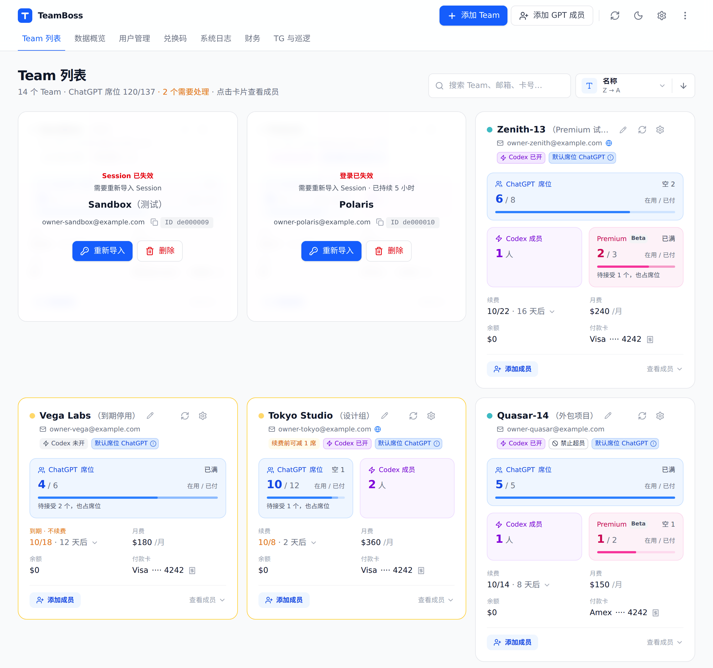
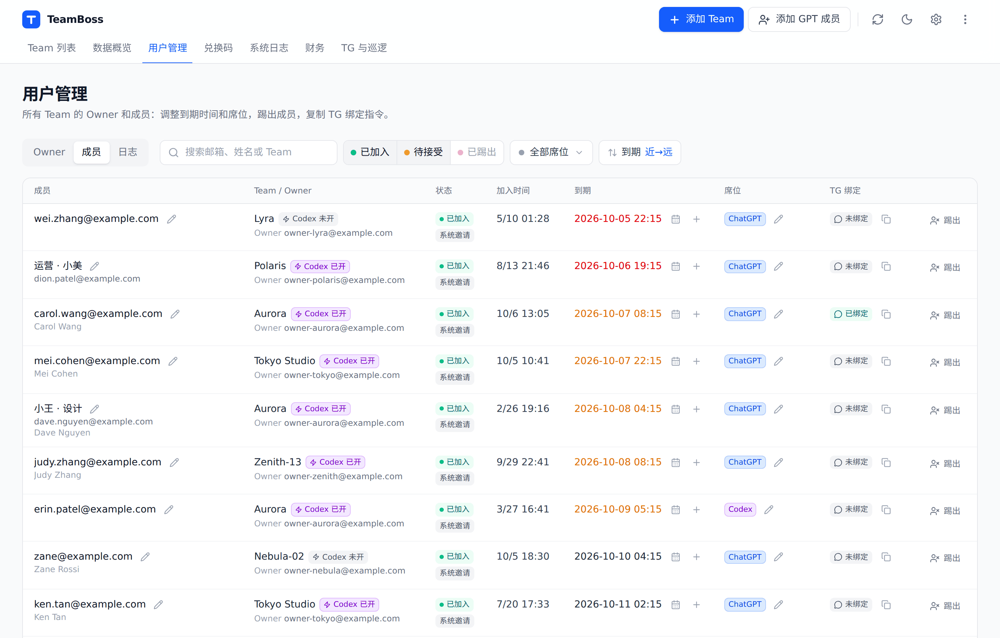
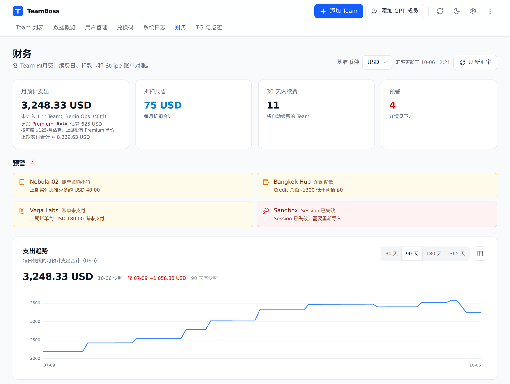
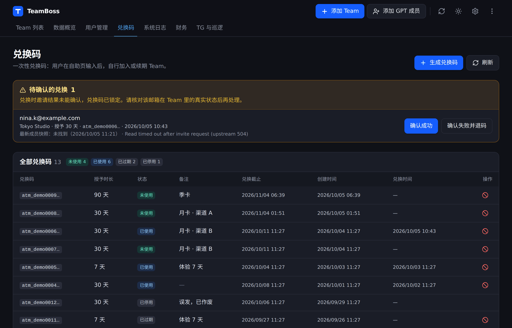
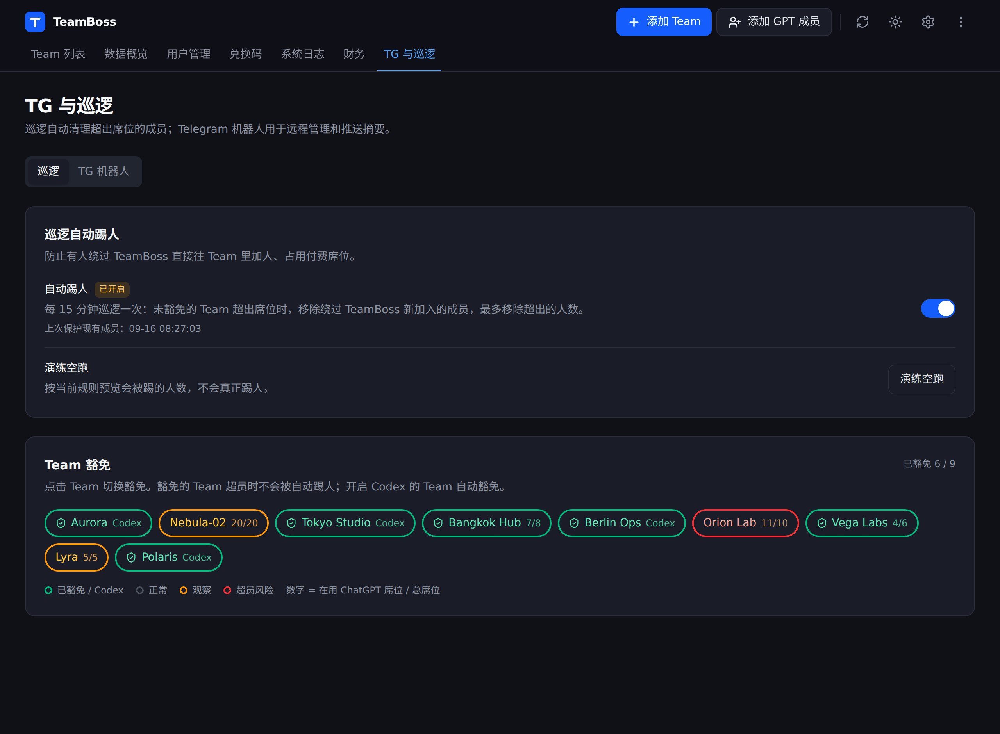
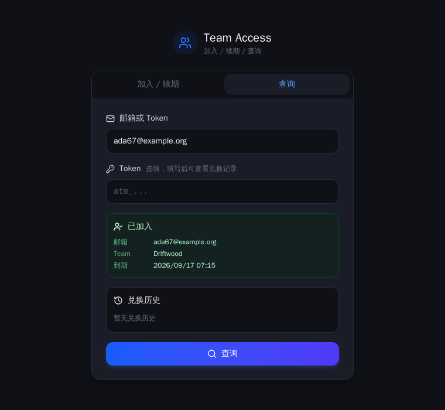

# TeamBoss

TeamBoss 是一个自托管的 ChatGPT Team / Business 工作区管理面板。用你自己的管理员账号登录后，它把多个团队的席位、成员、到期和账单集中到一个后台，并支持定时自动化与 Telegram 通知。后台会定时巡检各团队，发现计划外加入的成员时按你设定的规则移除。

> 第一次用？跳到 **[上手指南](docs/getting-started.md)** —— 从 `.env` 到「后台里有一个能用的 Team、成员能自己兑换」，包含 session JSON 到底从哪里取。



<details>
<summary><strong>免责声明</strong>（使用前请展开阅读）</summary>

1. 本项目仅供学习与技术研究，请勿用于任何非法用途。
2. 本项目与 OpenAI 无任何关联，并非其官方产品，相关商标归各自所有者所有。
3. 本项目所依赖的接口、成员操作方式及计费策略，均可能被官方随时调整，作者不保证功能的可用性、准确性与持续性。
4. 项目内展示的席位、账单、金额、到期时间等数据仅供参考，一切以官方后台为准。
5. 使用者应自行遵守所在地法律法规，以及与服务提供方之间的服务条款，并对自身使用行为负责。
6. 因使用本项目而产生的任何直接或间接后果，包括但不限于账号异常、财务损失、数据丢失，均由使用者自行承担，作者不承担任何责任。
7. 使用本项目即视为已阅读并同意本声明全部内容；若不同意，请停止使用并删除相关文件。

</details>

## 功能

- **多团队总览** —— 一屏看所有团队的席位使用（ChatGPT / Codex）、成员数、到期情况。
- **成员管理** —— 邀请、移除、切换席位类型（ChatGPT / Codex）。
- **到期与自动踢人** —— 给成员设到期时间，后台定时任务到点自动移除。
- **自助兑换** —— 生成一次性 access token，成员凭邮箱 + token 自助加入 / 续期 / 查自己的状态，无需你手动操作。
- **Session 管理** —— 导入 / 导出 ChatGPT 账号会话，access_token 过期自动用 session cookie 刷新。
- **财务** —— 订阅、账单、汇率换算展示。
- **巡检与告警** —— 定时巡检团队健康，异常通过 Telegram 告警；发现计划外成员时按设置自动移除（**出厂是空跑演练**，要在后台「TG 机器人 & 巡逻」页手动激活后才会真的移除人）。
- **Telegram 机器人** —— 团队状态与异常通知 + 常用命令（邀请 / 移除 / 查成员 / 查自己的到期等；管理命令仅限已配对管理员）。**默认关闭**，需填入 Bot Token 后在后台开启。
- **操作日志** —— 成员操作、团队管理、系统设置、代理、Telegram 配置、财务设置、巡检自动移除开关等写操作均留痕可查；密钥类字段只记掩码，不落明文。

## 界面

用户管理：按 Team 列出所有成员和待接受邀请，一行看完状态、到期、席位类型和 Telegram 绑定。



财务总览：各队订阅、折扣、余额按基准币种汇总，带 90 天支出趋势。



一次性兑换码：发给成员自助加入 / 续期，完整 Code 只在生成时显示一次。



巡逻自动踢人：默认关闭，可以先「演练空跑」看一眼会踢谁；开启前会把当前成员一次性豁免。



成员自助页（部署地址的根路径）：填邮箱 + 兑换码即可加入或续期，也能只填邮箱查自己的到期。



> 以上截图来自一套全部由虚构数据填充的演示实例，团队名、邮箱、金额、卡号均为编造。

## 技术栈

FastAPI + SQLite（后端）· React + Vite（前端）· Nginx（静态托管 + API 反代）· Docker Compose（推荐部署方式）。

## 部署

### Docker Compose

如需自托管，可用 Docker Compose 自行部署。需要 Docker Engine + **Compose v2.24 及以上**（`compose.yaml` 用了 `env_file` 的 `path` / `required` 长语法，更早的 v2 会直接解析失败）。

1. 准备配置：

   ```bash
   cp .env.example .env
   ```

   **务必**把 `AUTO_TEAM_ADMIN_PASSWORD`（≥8 位）和 `AUTO_TEAM_API_KEY`（**必须 `atk_` 开头且 ≥12 位**）改成随机强值——占位符和不合规的值会让后端首次启动直接报错退出。它们只在首次初始化数据库时写入，之后在后台里改。可选 `AUTO_TEAM_PORT` 改对外端口（默认 8080）。

2. 构建并后台启动：

   ```bash
   docker compose up -d --build
   ```

3. 在服务器本机验证起来了：

   ```bash
   docker compose ps
   curl -fsS http://127.0.0.1:8080/api/health
   ```

4. 打开后台 `http://127.0.0.1:8080/admin`，用 `.env` 里的管理员密码登录。

   > 后台入口是 **`/admin`**。根路径 `/` 是给成员用的自助兑换页（填邮箱 + 兑换码），不是登录页。

5. 登进去是一个空的 Dashboard。接下来怎么把第一个 Team 接进来、session JSON 从哪里取、
   哪些自动化默认是关的，见 **[上手指南](docs/getting-started.md)**。

**默认只监听 `127.0.0.1`，外网访问不到——这是故意的。** 整条链路是明文 HTTP，直接挂公网等于把管理员密码、API Key 和 ChatGPT 会话裸奔。对外访问请在宿主机上用 Nginx / Caddy 配好 TLS 证书，再反代到 `127.0.0.1:8080`。

如果本容器要藏在另一层反代后面（比如上面说的宿主机 Nginx/Caddy），还需要改
`docker/nginx.conf`：把 `set_real_ip_from` / `real_ip_header` 两行取消注释并填上那层
反代的来源网段（不是随手抄一个 CIDR——必须覆盖那层反代实际的连接来源地址）。不做这一步，
后端看到的每一个访客都会是**同一个**网桥网关地址（Docker 用户态转发 docker-proxy 的结果），
分不出谁是谁。后端能识别这种"访客身份坍缩"并打一条 warning 日志；此时它不按访客锁定——
否则任何人发 5 次错误密码就能把所有人连同管理员一起锁在外面——而是对全站做递增冷却：连续
答错 5 次后进入冷却，从 1 分钟开始逐次翻倍、封顶 15 分钟，登录成功即清零。这能把可被爆破的
次数压到每天百次以内，但冷却是全站共享的：有人持续乱试时，管理员重新登录也要等。要按访客
精确锁定，仍然得把 `set_real_ip_from` 配对，`docker/nginx.conf` 里有详细说明。

**宿主机防火墙（UFW/firewalld）挡不住这个端口**——Docker 发布端口是自己在 iptables 里加规则，
绕过宿主机防火墙的过滤链，"防火墙兜底"是假安全感。`AUTO_TEAM_BIND=0.0.0.0` 只应该在可信的
内网环境里使用；需要公网访问时，请在前面加一层反代终结 TLS 并回源到 `127.0.0.1`。

**后端必须单进程运行，不要加 `--workers`。** 定时任务（同步、巡检、自动踢人）**和 Telegram
机器人的轮询线程**都是在 FastAPI 的 lifespan 里随进程启动的，开 N 个 worker 就是 N 份并发跑
的同一套定时任务、N 个抢同一个 bot token 的长轮询（Telegram 侧会 409 互踢，命令还会被重复
执行）——不是限流精度打折扣，是真的会并发抢同一批 Team 做重复的邀请/踢人操作。自带的
`docker compose up` 和 `run_server.py` 都不加 `--workers`，照抄部署命令不会踩这个坑；
自己另起进程管理器（gunicorn / systemd 多实例等）时不要加这个参数。

维护：

```bash
docker compose logs -f
git pull && docker compose up -d --build   # 升级
docker compose down                        # 停止（不删数据）
```

业务数据（SQLite、会话、备份）存在名为 `auto_team_data` 的 Docker 命名卷里；`docker compose down` 不会删，只有 `down -v` 或手动删卷才会清。可用 `AUTO_TEAM_DATA_VOLUME` 换卷名，便于并行测试或迁移。

## 备份与恢复

### 自动备份

使用 `scripts/backup.py` 定期备份数据库和会话目录。脚本使用 SQLite 在线备份机制确保一致性，并会自动使用 `AUTO_TEAM_DATA_DIR`；未设置时使用 `backend/data`。

Docker Compose 部署：

```bash
docker compose exec backend python scripts/backup.py
docker compose exec backend python scripts/backup.py --keep-count 20
```

本机 Python 部署：

```bash
# 单次备份（使用默认参数）
python scripts/backup.py

# 自定义参数
python scripts/backup.py --keep-count 20 --backup-dir /path/to/backups
```

配置定期备份（cron，每天早上 2 点）：

```bash
0 2 * * * cd <项目目录> && python scripts/backup.py >> /var/log/auto_team_backup.log 2>&1
```

### 恢复数据

使用 `scripts/restore.sh` 恢复备份。恢复时必须停止后端写入；脚本会先校验数据库完整性或归档路径，再原子替换现有数据。

Docker Compose 部署（备份文件位于数据卷的 `/app/data/backups/`）：

```bash
docker compose stop backend
docker compose run --rm backend ./scripts/restore.sh \
  /app/data/backups/app-20260723T063420Z.db --skip-service-check
docker compose start backend
curl -fsS http://127.0.0.1:8080/api/health
```

不走 Docker、直接用进程管理器（systemd 等）跑后端时，把下面的 `<服务名>` 换成你自己的：

```bash
# 查看恢复用法
./scripts/restore.sh

# 恢复数据库备份
sudo systemctl stop <服务名>
./scripts/restore.sh <项目目录>/backend/data/backups/app-20260723T063420Z.db
sudo systemctl start <服务名>

# 恢复会话备份
sudo systemctl stop <服务名>
./scripts/restore.sh <项目目录>/backend/data/backups/sessions-20260723T063420Z.tar.gz
sudo systemctl start <服务名>
```

脚本会在替换前保留现有数据库或会话目录的恢复前副本。

## 配置项

环境变量、数据卷名沿用了项目早期的名字 `AUTO_TEAM_` / `auto_team_data`，改名会让现有部署的数据卷对不上，所以保留不动。

| 变量 | 说明 | 默认 |
|---|---|---|
| `AUTO_TEAM_ADMIN_PASSWORD` | 初始管理员密码（首启写库，≥8 位） | 必填 |
| `AUTO_TEAM_API_KEY` | 后端 API Key，**必须以 `atk_` 开头且 ≥12 位**（首启校验，不合规直接报错退出） | 必填 |
| `AUTO_TEAM_CORS_ORIGINS` | 允许的前端来源（逗号分隔） | 本地开发端口 |
| `AUTO_TEAM_TRUSTED_PROXIES` | 可信反向代理来源（逗号分隔 IP/CIDR）。只有来自这些地址的请求，其 `X-Real-IP`/`X-Forwarded-For` 才会被用作自助接口的限流身份；其余一律按直连 IP 计数，防止伪造请求头绕过限流。没有反代、端口直接暴露时设为空值 | 回环 + 内网私有段 |
| `AUTO_TEAM_PORT` | 对外 Web 端口 | `8080` |
| `AUTO_TEAM_BIND` | 对外 Web 端口的绑定地址，见上文「部署」 | `127.0.0.1` |
| `AUTO_TEAM_DATA_VOLUME` | 存放数据库 / 会话 / 备份的 Docker 命名卷名 | `auto_team_data` |
| `AUTO_TEAM_DATA_DIR` | 数据目录（裸机运行时用；镜像里已设成 `/app/data`） | `backend/data` |
| `AUTO_TEAM_BACKEND_HOST` / `AUTO_TEAM_BACKEND_PORT` | 后端监听地址与端口（**裸机运行必需**；Docker 里固定走容器内 8000，不读这两个值） | `127.0.0.1` / `18087` |
| `AUTO_TEAM_VERSION` | `/api/health` 与启动日志里报告的版本号；不设时回退到 `git rev-parse --short HEAD`，再回退到 `unknown`（镜像里没有 `.git` 时建议显式设置） | 空 |
| `VITE_API_BASE_URL` | 前端**构建期**变量，只影响本机 `npm run dev` / `npm run build`；Docker Compose 构建不读它（同源 `/api`，无需设置） | 空（`.env.example` 里给的是本机开发用的 `http://127.0.0.1:18087`） |

完整清单见 [`.env.example`](./.env.example)。

## 接口文档

- [`ADMIN_API.md`](./ADMIN_API.md) —— 一次性兑换码的管理方式：Telegram 指令出码、后台页面、以及写脚本时直接调的 HTTP 接口（需 `X-API-Key`）。
- 成员自助接口挂在 `/api/self-service` 下，无需认证，供根路径的自助页调用，也可以自己接前端：
  - `POST /api/self-service/redeem` —— 凭邮箱 + 兑换码加入或续期
  - `POST /api/self-service/query` —— 请求体字段是 `query`，填**邮箱或兑换码**均可，返回成员状态；兑换历史要另外用 `token` 出示一张这个邮箱自己用过的码，否则恒为空数组
  - `POST /api/self-service/status` —— 凭邮箱查当前是否还在团队里（自带的自助页没有调用它，留给自建前端）

  这三个接口按来源 IP 限流。挂在反代后面时务必配好 `AUTO_TEAM_TRUSTED_PROXIES`，否则所有访客会被算成同一个 IP。

## 安全须知

- **必须放在 TLS / 反向代理 / 防火墙后面。** Docker Compose 部署默认只把 Web 端口绑到 `127.0.0.1:8080`，后端容器不发布任何宿主机端口；务必在宿主机配置 HTTPS 并限制访问来源后再对外。
- **会话和密钥在数据卷里是明文存储**（ChatGPT 账号会话、API Key、Telegram token）。这是这类工具的固有风险：任何拿到数据卷 / 备份的人即可完全接管被管理的工作区。**请严格限制数据目录权限**：
  - 数据目录（`backend/data/`）：权限 `700`（仅所有者可访问）
  - 数据库文件（`backend/data/app.db`）：权限 `600`（仅所有者可读写）
  - 会话文件（`backend/data/sessions/*.json`）：权限 `600`（仅所有者可读写）
  - 备份文件（`backend/data/backups/*`）：权限 `600`（仅所有者可读写）

  妥善保管备份文件，建议定期离线备份到安全位置。
- `.env`、数据库、会话文件、备份已被 git 和 Docker 构建上下文忽略，不会进仓库或镜像。
- 首次启动后请通过后台修改密码 / 轮换 API Key，不要长期使用 `.env` 里的初始值。

## 成熟度

目前只有作者自己在生产环境跑，没有经过大范围真实使用的验证。涉及邀请、移除、到期、兑换的自动化都会直接改动你的工作区成员，接入前请先用一个不重要的团队跑一遍，确认行为符合预期再接生产。

## 许可证

[MIT](./LICENSE)。
